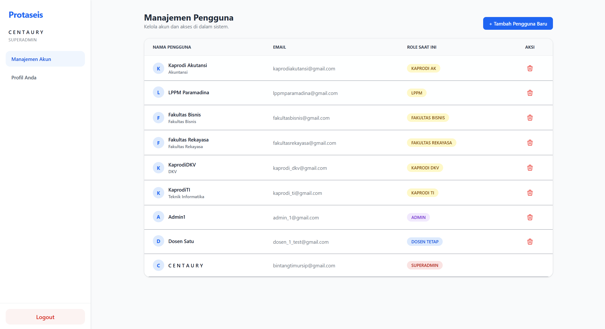
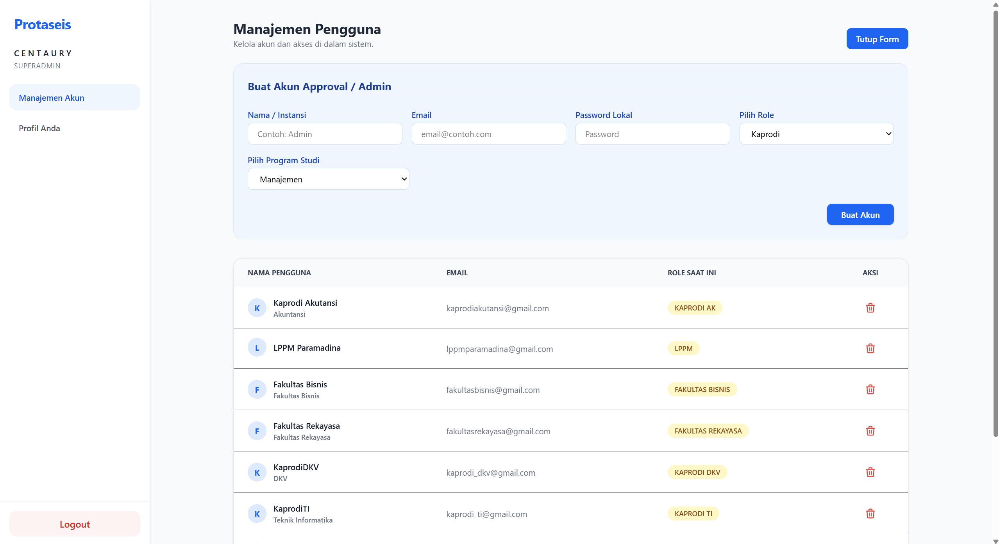
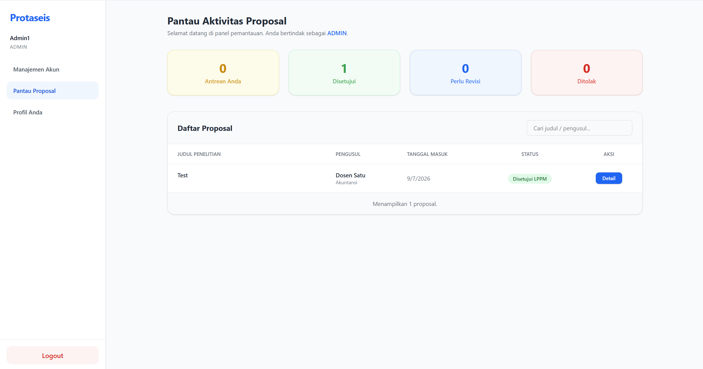
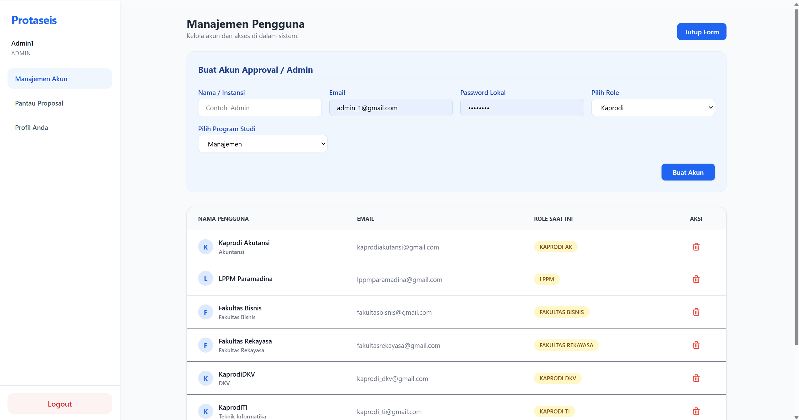
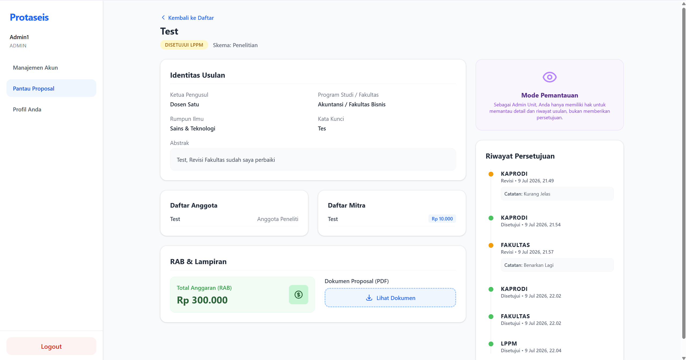
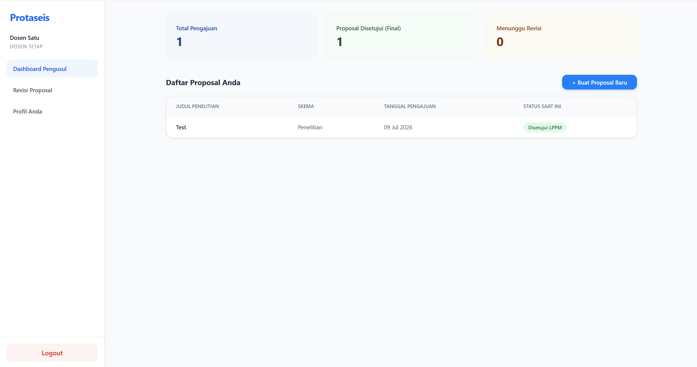

# Sistem Manajemen Proposal Penelitian

Aplikasi web untuk mengelola pengajuan proposal penelitian, peninjauan, dan persetujuan secara berjenjang antara Dosen, Kaprodi, Fakultas, dan LPPM.

## Ringkasan Proyek

- Tujuan: memfasilitasi alur proposal penelitian dari pengajuan dosen hingga validasi akhir oleh LPPM.
- Fitur utama:
  - Form pengajuan proposal lengkap (anggota, mitra, RAB, upload PDF)
  - Dashboard per peran pengguna
  - Alur persetujuan bertingkat dengan opsi setuju, revisi, dan tolak
  - Manajemen akun admin unit, Kaprodi, Fakultas, dan LPPM
  - Otentikasi JWT dan Google OAuth2

## Arsitektur dan Alur Proyek

### Struktur Arsitektur

- `backend/`: API server Node.js + Express + Mongoose
- `frontend/`: aplikasi React + Vite + Tailwind CSS
- `public/uploads/`: penyimpanan file upload dokumen dalam server lokal

### Alur Persetujuan Proposal

1. **Dosen** membuat proposal dan mengunggah dokumen.
   - Status awal: `Menunggu Kaprodi`
2. **Kaprodi** meninjau proposal.
   - Bisa memilih: `Setuju`, `Revisi`, `Tolak`
   - Jika setuju, status berubah menjadi `Menunggu Fakultas`
3. **Fakultas** meninjau proposal setelah persetujuan Kaprodi.
   - Jika setuju, status berubah menjadi `Menunggu LPPM`
   - Jika revisi, proposal kembali ke Dosen
4. **LPPM** melakukan validasi akhir.
   - Jika setuju, status: `Disetujui LPPM`
   - Jika revisi atau ditolak, proposal kembali ke Dosen
5. **Revisi**
   - Proposal yang diminta revisi oleh Kaprodi/Fakultas/LPPM dikembalikan ke Dosen.
   - Setelah Dosen memperbaiki, alur kembali ke `Menunggu Kaprodi`.

### Peran Pengguna Utama

- **Dosen**: mengajukan proposal, melihat status, mengunggah kembali revisi.
- **Kaprodi**: meninjau proposal jurusan dan mengirim keputusan ke Fakultas.
- **Fakultas**: meninjau proposal fakultas dan meneruskan persetujuan ke LPPM.
- **LPPM**: validasi akhir proposal.
- **Admin Unit**: membuat akun Kaprodi/Fakultas/LPPM dan memantau proposal.

## Teknologi yang Digunakan
- Frontend: React, Vite, Tailwind CSS
- Backend: Node.js, Express, Mongoose
- Database: MongoDB
- Autentikasi: JWT, Google OAuth2
- File upload: Multer (local filesystem)

## Instalasi dan Jalankan

### 1. Setup Backend
```bash
cd backend
npm install
```

Buat file `.env` di folder `backend/`:
```env
PORT=3000
MONGO_URI=mongodb://localhost:27017/ProposalManagement
JWT_SECRET=rahasia_super_aman
GOOGLE_CLIENT_ID=client_id_anda
```

Jalankan backend:
```bash
npm run dev
```

### 2. Setup Frontend
```bash
cd frontend
npm install
```

Buat file `.env` di folder `frontend/`:
```env
VITE_API_URL=http://localhost:3000
VITE_GOOGLE_CLIENT_ID=client_id_anda
```

Jalankan frontend:
```bash
npm run dev
```

## Catatan Penting
- Admin Unit dapat membuat akun Kaprodi, Fakultas, dan LPPM.
- Password default akun yang dibuat manual: `password123`.
- Pastikan MongoDB berjalan di `localhost:27017`.

## Alur Pengembangan

1. Backend menangani API auth, proposal, user, dan upload file.
2. Frontend menampilkan halaman login, dashboard, form proposal, dan review status.
3. Setiap keputusan reviewer memperbarui status proposal di database.
4. Proposal revisi kembali ke Dosen dan alur dimulai ulang.

## Dokumentasi Tampilan

### Screenshot Utama
- Dashboard Super Admin
  
- Halaman pembuatan akun admin unit / Kaprodi / Fakultas / LPPM
  
- Dashboard Admin Unit
  
- Form pembuatan akun Kaprodi / Fakultas / LPPM
  
- Detail proposal di akun admin
  
- Dashboard Pengusul
  
  Form Pengisian pengusul
   
   
   
  
  

  

## Hak Cipta

Kelompok 1
1. BINTANG TIMUR - 123103025
2. Fakhri Andika - 124103055

